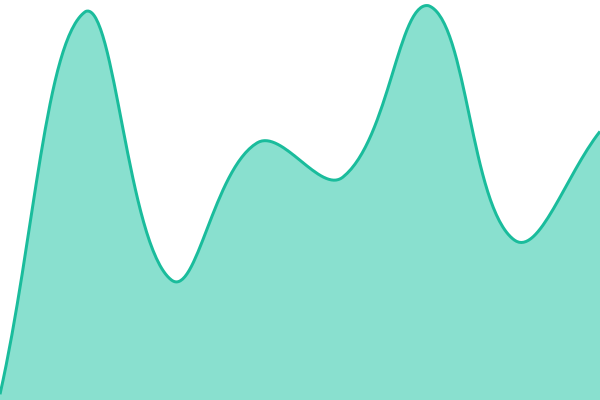
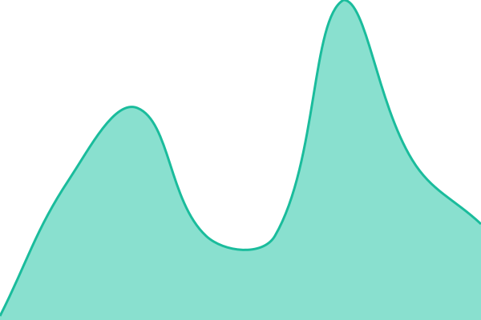
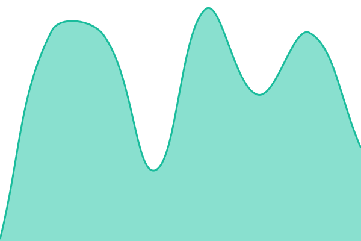

# [📈 Live Status](https://fhonores.github.io/upptime): <!--live status--> **🟧 Partial outage**

This repository contains the open-source uptime monitor and status page for [fhonores](https://fhonores.github.io/upptime), powered by [Upptime](https://github.com/upptime/upptime).

With [Upptime](https://upptime.js.org), you can get your own unlimited and free uptime monitor and status page, powered entirely by a GitHub repository. We use [Issues](https://github.com/fhonores/upptime/issues) as incident reports, [Actions](https://github.com/fhonores/upptime/actions) as uptime monitors, and [Pages](https://fhonores.github.io/upptime) for the status page.

<!--start: status pages-->
<!-- This summary is generated by Upptime (https://github.com/upptime/upptime) -->
<!-- Do not edit this manually, your changes will be overwritten -->
<!-- prettier-ignore -->
| URL | Status | History | Response Time | Uptime |
| --- | ------ | ------- | ------------- | ------ |
|  [Novios CL](https://www.noviosfalabella.com/novios-cl/public/inicio.do) | 🟥 Down | [novios-cl.yml](https://github.com/fhonores/upptime/commits/HEAD/history/novios-cl.yml) | 

 329ms
     
 | 

<a href="https://fhonores.github.io/upptime/history/novios-cl">5.48%</a>
    

|  [Novios PE](https://www.noviosfalabella.com.pe/novios-pe/public/inicio.do) | 🟥 Down | [novios-pe.yml](https://github.com/fhonores/upptime/commits/HEAD/history/novios-pe.yml) | 

 352ms
     
 | 

<a href="https://fhonores.github.io/upptime/history/novios-pe">1.20%</a>
    

|  [Novios CO](https://www.noviosfalabella.com.co/novios-co/public/inicio.do) | 🟩 Up | [novios-co.yml](https://github.com/fhonores/upptime/commits/HEAD/history/novios-co.yml) | 

 1567ms
     
 | 

<a href="https://fhonores.github.io/upptime/history/novios-co">99.72%</a>
    

|  Escanea & Paga CL | 🟥 Down | [escanea-and-paga-cl.yml](https://github.com/fhonores/upptime/commits/HEAD/history/escanea-and-paga-cl.yml) | 

 110ms
     
 | 

<a href="https://fhonores.github.io/upptime/history/escanea-and-paga-cl">0.00%</a>
    

<!--end: status pages-->

[**Visit our status website →**](https://fhonores.github.io/upptime)

## 📄 License

- Powered by: [Upptime](https://github.com/upptime/upptime)
- Code: [MIT](./LICENSE) © [fhonores](https://fhonores.github.io/upptime)
- Data in the `./history` directory: [Open Database License](https://opendatacommons.org/licenses/odbl/1-0/)
